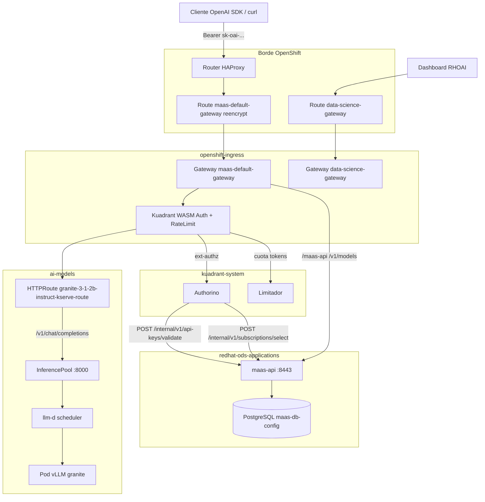
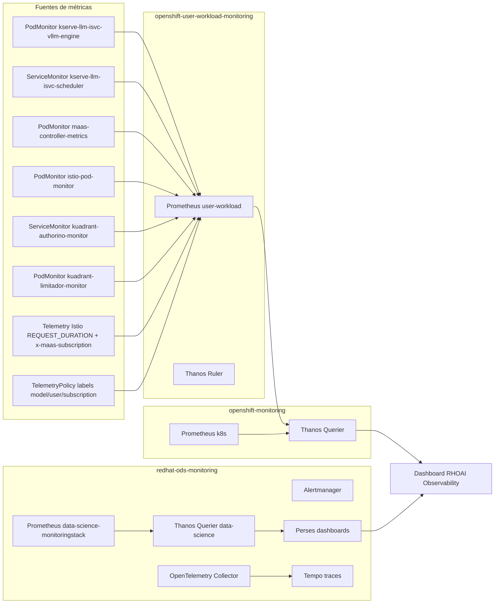
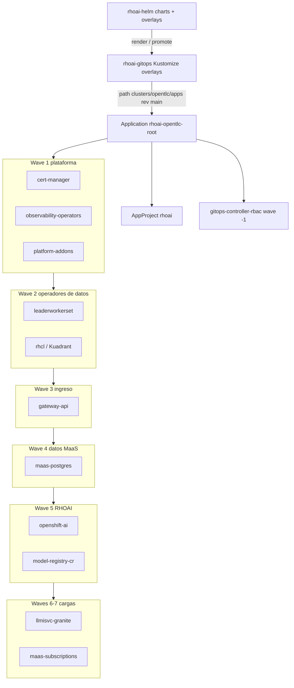
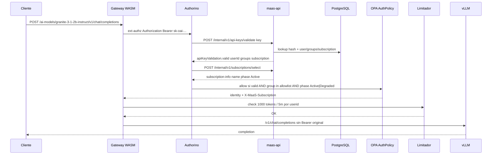

# Arquitectura — Red Hat OpenShift AI 3.4 y Models-as-a-Service

Documento de arquitectura del repositorio `rhoai-helm` y de la infraestructura observada en el clúster OpenTLC lab (`cluster-zd9hr`, sandbox1414) el 26 de agosto de 2026. Los overlays Helm describen también el destino de producción `ocpai-prd-mtz` (OpenShift 4.22, 12× NVIDIA H200), que no está desplegado en este contexto.

| Dato | Valor observado |
| --- | --- |
| Producto | OpenShift AI Self-Managed **3.4.3** |
| DataScienceCluster | `default-dsc` — fase `Ready` |
| Serving | KServe **v0.17.0**, vLLM **v0.18.0**, llm-d inference-scheduler **v0.7.1** |
| GitOps | OpenShift GitOps / Argo CD 3.4, raíz `rhoai-opentlc-root` |
| Ingress MaaS | Gateway `maas-default-gateway` (`gatewayClassName: openshift-default`) |
| Modelo lab | `LLMInferenceService/granite-3-1-2b-instruct` en `ai-models` (CPU, Ready) |
| Kubernetes | v1.33.13 (RHCOS 9.6, OpenShift 4.20 en este lab) |

---

## 1. Resumen ejecutivo

Este repositorio empaqueta **Red Hat OpenShift AI (RHOAI) 3.4** y **Models-as-a-Service (MaaS)** como charts Helm reutilizables, con overlays por clúster. El patrón de diseño es **GitOps App-of-Apps**: Helm es la fuente de verdad de plantillas y valores; el repositorio hermano [`rhoai-gitops`](https://github.com/abelluque/rhoai-gitops) materializa overlays Kustomize que Argo CD reconcilia en el clúster.

### Propósito

- Desplegar de forma repetible la plataforma de inferencia (KServe / vLLM / llm-d) y el plano de control MaaS (API keys, suscripciones, rate limits).
- Separar **laboratorio OpenTLC** (sin GPU, un SLM CPU para validar el cableado) de **producción `ocpai-prd-mtz`** (tres LLMs en H200, Postgres externo, Nutanix Files).
- Sustituir Service Mesh 2/3 como plano de datos: en OpenShift 4.19+ el **Ingress Operator** es el controlador de Gateway API (`openshift.io/gateway-controller/v1`). Kuadrant (Red Hat Connectivity Link) aplica AuthPolicy y TokenRateLimitPolicy sobre esas HTTPRoutes.

### Patrones de diseño

| Patrón | Uso en este repo |
| --- | --- |
| **Helm overlays** | `charts/*` + `clusters/{cluster}/cluster.yaml` + `platform/values` o `values` por aplicación. Overlay posterior gana. |
| **App-of-Apps (Argo CD)** | `rhoai-opentlc-root` apunta a `clusters/opentlc/apps` en `rhoai-gitops`. Hijos con `sync-wave` -1…7. |
| **Sync waves + Jobs post-install** | Operadores OLM primero; CRDs y CRs (`Kuadrant`, `DSC`, `LeaderWorkerSet`) vía Jobs que esperan al CRD. |
| **Gateway API** | Un Gateway compartido `maas-default-gateway` en `openshift-ingress`. Modelos y MaaS API se adhieren con HTTPRoute. |
| **Kuadrant / Authorino / Limitador** | AuthPolicy WASM en el sidecar Istio del Gateway; Authorino valida `sk-oai-…`; Limitador aplica cuotas de tokens. |
| **KServe LLMInferenceService** | RawDeployment + InferencePool + scheduler llm-d. Router reescribe `/ai-models/<model>/v1/chat/completions` → `/v1/chat/completions`. |
| **Contrato de nombres** | La clave Helm de `llmisvc` (`fullnameOverride`) debe coincidir con `maas-subscriptions.modelRefs`, `subscriptions` y `authPolicies`. |

Dos overlays:

| Overlay | Clúster | Modelos | Storage | Postgres MaaS |
| --- | --- | --- | --- | --- |
| `clusters/opentlc` | Lab OpenTLC, 3 workers `m6a.4xlarge` | Granite 3.1 2B CPU | `gp3-csi` | In-cluster |
| `clusters/ocpai-prd-mtz` | 11 nodos, 2 SuperMicro 6× H200 | Granite 8B, Qwen 32B, DeepSeek 33B | Nutanix Files | Externo (day-2) |

El overlay OpenTLC todavía plantilla hostnames `maas.apps.cluster-6f7dh…`. El clúster vivo es `cluster-zd9hr` (`router-default.apps.cluster-zd9hr.zd9hr.sandbox1414.opentlc.com`). El Route está Admitido; el hostname del spec no coincide con el DNS del lab actual.

---

## 2. Arquitectura de infraestructura y componentes

### 2.1 Vista por capas

```text
┌──────────────────────────────────────────────────────────────────────────┐
│ Clientes  (OpenAI SDK, curl, Dashboard RHOAI, MaaS API /v1/models)       │
└──────────────────────────────────────────────────────────────────────────┘
                                    │ HTTPS
┌──────────────────────────────────────────────────────────────────────────┐
│ Capa de plataforma e ingreso                                             │
│  OpenShift Router  →  Route reencrypt  →  Gateway (Istio dataplane)      │
│  cert-manager · GitOps · Pipelines · User Workload Monitoring            │
└──────────────────────────────────────────────────────────────────────────┘
                                    │
          ┌─────────────────────────┴─────────────────────────┐
          ▼                                                   ▼
┌─────────────────────────────┐                 ┌─────────────────────────┐
│ Plano de control MaaS       │                 │ Plano de control IA     │
│ Kuadrant AuthPolicy (WASM)  │                 │ RHOAI operator + DSC    │
│ Authorino  ·  Limitador     │                 │ KServe · llm-d · vLLM   │
│ maas-api  ·  PostgreSQL     │                 │ Model Registry          │
│ MaaSSubscription / AuthPol. │                 │ Dashboard · Workbenches │
└─────────────────────────────┘                 └─────────────────────────┘
```

Nodos del lab (6): 3 control-plane no schedulable, 3 workers con `workload.rhoai.io/platform=true`. Toda la plataforma y el SLM CPU corren en esos workers. En producción, la plataforma va a VMs infra/virt; los LLM a nodos GPU con taint `nvidia.com/gpu=true:NoSchedule`.

### 2.2 Plataforma y GitOps

| Componente | Chart / app Argo | Namespace(s) | Rol |
| --- | --- | --- | --- |
| OpenShift GitOps | `platform-addons` | `openshift-gitops`, `openshift-gitops-operator` | Argo CD. Root app `rhoai-opentlc-root`. Job `patch-gitops-argocd` ajusta `nodePlacement` y Lua de salud de PVC. |
| GitOps controller RBAC | `gitops-controller-rbac` (wave -1) | cluster-scoped | `cluster-admin` al SA `openshift-gitops-argocd-application-controller` para Server-Side Apply. |
| cert-manager | `cert-manager` | `cert-manager-operator`, `cert-manager` | TLS de operadores y, en prod, certificados Venafi del Gateway. |
| Observability operators | `observability-operators` | `openshift-operators`, `openshift-tempo-operator`, `openshift-opentelemetry-operator`, `openshift-cluster-observability-operator` | Tempo, OpenTelemetry, Cluster Observability (Perses). |
| OpenShift Pipelines | `platform-addons` | `openshift-operators`, `openshift-pipelines` | Tekton. PVC `pipelines-artifacts` (WaitForFirstConsumer, sin consumer). |
| Storage / registry | `platform-addons` | `rhoai-model-registries`, `rhods-notebooks` | MySQL + MinIO del Model Registry; PVC de notebooks. |
| LeaderWorkerSet | `leaderworkerset` | `openshift-lws-operator` | Requisito de KServe llm-d (multi-node serving). |
| NVIDIA (solo prod) | `nvidia-gpu-enablement` | `openshift-nfd` | NFD + GPU Operator + ClusterPolicy. **No** se instala en OpenTLC. |

GitOps no instala Helm releases en el clúster: Argo aplica manifiestos Kustomize generados desde estos charts. Helm directo (`clusters/*/scripts/install-waves.sh`) es el camino de ensayo/bootstrap.

`service-mesh-operators` es **referencia legada**. En 4.19+ no debe instalarse: el Ingress Operator ya versiona CRDs de Gateway API y programa el dataplane Istio en `openshift-ingress`. Un segundo SM3 deja el Gateway sin programar.

### 2.3 Plano de control de IA (RHOAI, KServe, vLLM)

Chart `openshift-ai` instala el operador `rhods-operator` y, vía Jobs, `DSCInitialization` + `DataScienceCluster/default-dsc`.

Componentes **Managed** en el lab (y alineados con el overlay):

| Componente DSC | Estado | Notas |
| --- | --- | --- |
| `kserve` + `modelsAsService` | Managed | RawDeployment Headless; MaaS platform manifests + `maas-api`. |
| `dashboard` | Managed | Flags MaaS / GenAI Studio / observability. |
| `modelregistry` | Managed | Namespace `rhoai-model-registries`. |
| `llamastackoperator` | Managed | Llama Stack 0.7.1. |
| `trustyai` | Managed | Eval online/code execution deny. |
| `workbenches` | Managed | Namespace `rhods-notebooks`. |
| `aipipelines`, `kueue`, `ray`, `trainer`, `trainingoperator`, `feastoperator`, `mlflowoperator` | Removed | Fuera de alcance MaaS. |

`DSCInitialization.serviceMesh.managementState: Removed` — RHOAI no instala Service Mesh 2.

Cada modelo es un chart `llmisvc` → `LLMInferenceService`:

- Imagen de inferencia: RHAIIS `registry.redhat.io/rhaii/vllm-cpu-rhel9:3.4.1` (lab) o imagen GPU en prod.
- `spec.router.gateway.refs` apunta a `maas-default-gateway` cuando `maas.enabled: true`.
- KServe crea HTTPRoute, InferencePool, Service de workload, ServiceMonitors del scheduler y PodMonitor del motor vLLM.
- HardwareProfile `cpu-platform` (lab) o perfil GPU (prod) con `nodeSelector` / tolerations.

En el lab vive un único ISVC: `granite-3-1-2b-instruct` (URI `hf://ibm-granite/granite-3.1-2b-instruct`, 1 réplica, 4–8 CPU / 16–32 Gi, KV cache capado). En prod: `granite-3-0-8b-instruct`, `qwen25-coder-32b`, `deepseek-coder-33b` en nodos H200.

### 2.4 Plano de control MaaS (Kuadrant, Authorino, Limitador, Gateway API)

| Pieza | Dónde | Función |
| --- | --- | --- |
| Red Hat Connectivity Link (`rhcl`) | `kuadrant-system` | Operador Kuadrant + Authorino + Limitador + plugin de consola. Job `patch-rhcl-csv` añade `openshift.io/gateway-controller/v1` a `ISTIO_GATEWAY_CONTROLLER_NAMES`. |
| `Kuadrant` CR | `kuadrant-system` | Instancia Authorino + Limitador. Pods `authorino-*`, `limitador-limitador-*`. |
| Gateway `maas-default-gateway` | `openshift-ingress` | Listener HTTPS:443, `allowedRoutes.from: All`, TLS Terminate contra Secret `maas-gw-service-tls`. |
| Route `maas-default-gateway` | `openshift-ingress` | HAProxy reencrypt, timeout 10m, hacia Service `maas-default-gateway-openshift-default:443`. |
| Gateway `data-science-gateway` | `openshift-ingress` | Gateway del dashboard RHOAI (`data-science-gateway-class`), no el path MaaS. |
| `maas-api` | `redhat-ods-applications` | Emite y valida API keys; selecciona suscripción. Postgres vía Secret `maas-db-config`. |
| `MaaSAuthPolicy` / `MaaSSubscription` / `MaaSModelRef` | `models-as-a-service` | CRs de producto. El `maas-controller` materializa AuthPolicy y TokenRateLimitPolicy de Kuadrant. |

En el lab: `MaaSAuthPolicy/free-models-access` y `MaaSSubscription/free-models-subscription` (Ready). El controlador genera:

- `AuthPolicy/maas-auth-granite-3-1-2b-instruct` (Enforced) sobre la HTTPRoute del modelo.
- `AuthPolicy/maas-api-auth-policy` sobre `maas-api-route`.
- `AuthPolicy/gateway-default-auth` (deny por defecto; Overridden por las rutas específicas).
- `TokenRateLimitPolicy/maas-trlp-granite-3-1-2b-instruct` — 1000 tokens / 5m por `auth.identity.userid`.

### 2.5 Flujo de tráfico: del usuario al modelo

1. El cliente llama `https://maas.apps.<cluster>.<baseDomain>/ai-models/granite-3-1-2b-instruct/v1/chat/completions` con `Authorization: Bearer sk-oai-…`.
2. El **OpenShift Router** termina TLS de borde (reencrypt) y envía al Service ClusterIP del Gateway.
3. El **dataplane Istio** del Gateway (`openshift-gateway`) aplica el WASM de Kuadrant (AuthPolicy + TokenRateLimitPolicy) **antes** del routing.
4. **Authorino** (ext-authz):
   - Si el header coincide con `^Bearer sk-oai-.*`, POST a `https://maas-api.redhat-ods-applications.svc:8443/internal/v1/api-keys/validate`.
   - Con la identidad resultante, POST a `/internal/v1/subscriptions/select` (modelo pedido + grupos + suscripción).
   - OPA: la key debe ser `valid`, el usuario/grupo debe estar en `system:authenticated`, y la suscripción en fase `Active` o `Degraded`.
5. **Limitador** cuenta tokens por `auth.identity.userid` si `selected_subscription_key` coincide; no aplica a `GET …/v1/models`.
6. La HTTPRoute reescribe el prefix a `/v1/chat/completions` (u otro endpoint OpenAI) y envía al **InferencePool** (puerto 8000) o al Service de workload.
7. El **scheduler llm-d** elige un pod vLLM; vLLM sirve la inferencia.

Gestión de keys (otro path, misma Gateway):

- `GET/POST /maas-api/…` y `/v1/models` → `maas-api-route` → Service `maas-api:8443`.
- Auth: misma validación `sk-oai-…` **o** TokenReview de OpenShift (audiences `kubernetes.default.svc` y `maas-default-gateway-sa`).
- Health `GET /maas-api/health` queda fuera de la AuthPolicy.

El dashboard RHOAI (`rhods-dashboard` HTTPRoute) usa `data-science-gateway`, no el Gateway MaaS.

---

## 3. Diagramas de arquitectura

### 3.1 Ingress, autenticación y enrutamiento hacia KServe / vLLM



### 3.2 Monitoreo: ServiceMonitor / PodMonitor, UWM, Thanos, dashboard RHOAI



`cluster-monitoring-config` en `openshift-monitoring` fija `enableUserWorkload: true`. El DSCInitialization deja `monitoring.managementState: Managed` en `redhat-ods-monitoring` (MonitoringStack, Perses, Tempo, collector OTel). El dashboard RHOAI (`observabilityDashboard: true`) consulta Thanos + Perses.

Etiquetas de negocio en el Gateway: Istio Telemetry `latency-per-subscription` hace UPSERT de `subscription` desde `x-maas-subscription`; Kuadrant `TelemetryPolicy/maas-telemetry` etiqueta `model`, `user`, `subscription`, `organization_id`, `cost_center` desde `auth.identity`.

### 3.3 Árbol App-of-Apps (Argo CD) y charts Helm



Hijos observados en `openshift-gitops` (sync waves en metadata):

| Wave | Application | Source path (rhoai-gitops) | Destino |
| --- | --- | --- | --- |
| -1 | `gitops-controller-rbac` | `components/gitops-controller-rbac/overlays/opentlc` | cluster |
| -1 | AppProject `rhoai` | `clusters/opentlc/apps` | `openshift-gitops` |
| 1 | `cert-manager` | `components/cert-manager/overlays/opentlc` | `cert-manager-operator` |
| 1 | `observability-operators` | `components/observability-operators/overlays/opentlc` | `openshift-operators` |
| 1 | `platform-addons` | `components/platform-addons/overlays/opentlc` | `rhoai-model-registries` |
| 2 | `leaderworkerset` | `components/leaderworkerset/overlays/opentlc` | `openshift-lws-operator` |
| 2 | `rhcl` | `components/rhcl/overlays/opentlc` | `kuadrant-system` |
| 3 | `gateway-api` | `components/gateway-api/overlays/opentlc` | `openshift-ingress` |
| 4 | `maas-postgres` | `components/maas-postgres/overlays/opentlc` | `redhat-ods-applications` |
| 5 | `openshift-ai` | `components/openshift-ai/overlays/opentlc` | `redhat-ods-operator` |
| 5 | `model-registry-cr` | `components/model-registry-cr/overlays/opentlc` | `rhoai-model-registries` |
| 6 | `llmisvc-granite` | `components/llmisvc-granite/overlays/opentlc` | `ai-models` |
| 7 | `maas-subscriptions` | `components/maas-subscriptions/overlays/opentlc` | `models-as-a-service` |

En `ocpai-prd-mtz` el mismo árbol añade `nvidia-gpu-enablement` (wave 2) y tres apps `llmisvc-*` (wave 6). Sync policy típica: `automated.selfHeal`, `ServerSideApply=true`, `CreateNamespace=true`, `SkipDryRunOnMissingResource` en CRs cuyo CRD aún no existe.

---

## 4. Configuración de seguridad y autenticación

### 4.1 Políticas de acceso MaaS

Hay **dos niveles** de CR:

1. **Producto RHOAI** (`maas.opendatahub.io`): `MaaSAuthPolicy`, `MaaSSubscription`, `MaaSModelRef`. Los declara el chart `maas-subscriptions`.
2. **Enforcement Kuadrant** (`kuadrant.io`): `AuthPolicy` y `TokenRateLimitPolicy` que genera el `maas-controller` a partir de (1).

Lab — `MaaSAuthPolicy/free-models-access`:

- Namespace: `models-as-a-service`
- Tier: `free`
- ModelRefs: `ai-models/granite-3-1-2b-instruct`
- Grupos: `system:authenticated`
- Usuarios: ninguno (lista vacía)

Lab — `MaaSSubscription/free-models-subscription`:

- Owner groups: `system:authenticated`
- Modelo: Granite 2B, `tokenRateLimits: 1000 / 5m`
- Priority: 0

Producción añade `premium-models-subscription` (Qwen + DeepSeek, 10000 / 2m) y `premium-models-access` para grupos `system:authenticated` y `premium-users`. **El nombre del modelo en la suscripción debe ser el `fullnameOverride` del `llmisvc`.**

El Gateway lleva un AuthPolicy por defecto `gateway-default-auth` que niega rutas no configuradas (`deny-unconfigured-models`). Las HTTPRoutes de modelo y de `maas-api` lo **overridean** (status `Overridden`).

### 4.2 Flujo de validación de API keys `sk-oai-…` y asignación de suscripción

Prefijo de key: `Bearer sk-oai-.*` (regla `when` en AuthPolicy). No es un JWT; es un secreto opaco que `maas-api` guarda en Postgres.



Detalles de enforcement (AuthPolicy del modelo, Enforced):

| Etapa | Mecanismo | Criterio |
| --- | --- | --- |
| Autenticación `api-keys` | Header `authorization` en claro si match `sk-oai-` | Prioridad 0 |
| Autenticación `kubernetes-tokens` | TokenReview audience `kubernetes.default.svc` | Solo path `.*/v1/models$` |
| Metadata `apiKeyValidation` | HTTP POST a maas-api, cache 60s por valor de la key | `valid == true` |
| Metadata `subscription-info` | HTTP POST select (username, groups, requestedSubscription, requestedModel) | name no vacío, error vacío |
| AuthZ `auth-valid` | Rego | key válida **o** identidad K8s/OIDC |
| AuthZ `require-group-membership` | Rego | `system:authenticated` (lab) |
| AuthZ `subscription-valid` | Rego | phase `Active` o `Degraded`, no deleting |
| Respuesta éxito | Headers | `Authorization` se vacía (no se reenvía la key a vLLM); `X-MaaS-Subscription` se inyecta |
| Fallo | 401 / 403 | 403 usa el mensaje de `subscription-info` |

`maas-api-auth-policy` (ruta de gestión) además:

- Acepta TokenReview OpenShift si el Bearer **no** es `sk-oai-`.
- Rechaza headers inyectados por el cliente (`x-maas-username`, `x-maas-group`).
- Propaga `X-MaaS-Username`, `X-MaaS-Group`, `X-MaaS-Subscription` hacia `maas-api`.

Rate limit (lab): contador `auth.identity.userid`, 1000 / 5m, solo si `selected_subscription_key == models-as-a-service/free-models-subscription@ai-models/granite-3-1-2b-instruct`. Paths `/v1/models` exentos.

RBAC de plataforma adicional: NetworkPolicy de Authorino (chart `openshift-ai`), serving-cert en el Service de Authorino, TLS de Authorino parcheado por Job. El SA del application-controller de Argo tiene `cluster-admin` para SSA.

---

## 5. Matriz de integración y observabilidad

Endpoints de métricas: salvo nota, el scrape lo hace **User Workload Monitoring** (`openshift-user-workload-monitoring`) o el MonitoringStack de RHOAI. Los operadores de plataforma los scrapea Prometheus de `openshift-monitoring`.

| Componente | Namespace | Recursos principales | Métricas / scrape |
| --- | --- | --- | --- |
| Argo CD / GitOps | `openshift-gitops` | Application, AppProject, ArgoCD CR | SM `openshift-gitops`, `…-server`, `…-repo-server` |
| GitOps operator | `openshift-gitops-operator` | Subscription, CSV | SM `openshift-gitops-operator-metrics-monitor` |
| cert-manager | `cert-manager` / `cert-manager-operator` | Certificate, ClusterIssuer, Subscription | métricas del operador (OLM) |
| Tempo operator | `openshift-tempo-operator` | Subscription | SM `tempo-operator-controller-manager-metrics-monitor` |
| OpenTelemetry operator | `openshift-opentelemetry-operator` | Subscription | SM `opentelemetry-operator-metrics-monitor` |
| Cluster Observability | `openshift-cluster-observability-operator` | Subscription | SM `observability-operator` |
| UWM | `openshift-user-workload-monitoring` | Prometheus, Thanos Ruler | SM `prometheus-user-workload`, `thanos-ruler`, `thanos-sidecar` |
| Plataforma Prometheus | `openshift-monitoring` | Prometheus, Thanos Querier | SM `prometheus-k8s`, `thanos-querier`, `thanos-sidecar` |
| RHOAI monitoring | `redhat-ods-monitoring` | MonitoringStack, Perses, TempoMonolithic, OpenTelemetryCollector | Prometheus `data-science-monitoringstack`; Thanos Querier `data-science-thanos-querier`; Tempo; Perses |
| Kuadrant operator | `kuadrant-system` | Kuadrant CR, AuthPolicy, TokenRateLimitPolicy | SM `kuadrant-operator-monitor` |
| Authorino | `kuadrant-system` | Authorino CR, Deployment | SM `kuadrant-authorino-monitor`, `authorino-operator-monitor` |
| Limitador | `kuadrant-system` | Limitador CR | PodMonitor `kuadrant-limitador-monitor`; SM `limitador-operator-monitor` |
| Ingress / Gateway | `openshift-ingress` | Gateway, HTTPRoute, Route, Istio dataplane | PodMonitor `istio-pod-monitor`; SM `router-default`; Telemetry `latency-per-subscription`; TelemetryPolicy `maas-telemetry` |
| RHOAI operator | `redhat-ods-operator` | DSC, DSCI | condiciones del DSC |
| MaaS API / controller | `redhat-ods-applications` | Deployment `maas-api`, HTTPRoute `maas-api-route` | PodMonitor `maas-controller-metrics`; SM `model-serving-api-metrics`, `odh-model-controller-metrics-monitor` |
| Postgres MaaS | `redhat-ods-applications` | Deployment `postgres`, Secret `maas-db-config` | sin SM dedicado (lab) |
| Dashboard / workbenches | `redhat-ods-applications`, `rhods-notebooks` | HTTPRoute `rhods-dashboard`, PVC notebooks | dashboard consume Thanos/Perses |
| Model Registry | `rhoai-model-registries` | ModelRegistry CR, MySQL, MinIO | kube-rbac-proxy del registry |
| LLM Granite (lab) | `ai-models` | LLMInferenceService, HTTPRoute, InferencePool, AuthPolicy, TokenRateLimitPolicy | PodMonitor `kserve-llm-isvc-vllm-engine`; SM `kserve-llm-isvc-scheduler` |
| LeaderWorkerSet | `openshift-lws-operator` | Subscription, LWS instance | SM `lws-controller-manager-metrics-monitor` |
| Pipelines | `openshift-pipelines` | Tekton, PVC `pipelines-artifacts` | SM `openshift-pipelines-monitor` y derivados |
| TrustyAI | `redhat-ods-applications` | operator | SM `trustyai-service-operator-service-monitor` |

Rutas / hostnames relevantes (lab):

| Superficie | Recurso | Hostname |
| --- | --- | --- |
| API MaaS + inferencia | Route + Gateway `maas-default-gateway` | Spec overlay: `maas.apps.cluster-6f7dh.6f7dh.sandbox3519.opentlc.com`. Router canónico vivo: `router-default.apps.cluster-zd9hr.zd9hr.sandbox1414.opentlc.com` |
| Chat completions | HTTPRoute del ISVC | `/ai-models/granite-3-1-2b-instruct/v1/chat/completions` |
| Completions / responses | misma HTTPRoute | `/v1/completions`, `/v1/responses` (rewrite) |
| Catálogo / keys | HTTPRoute `maas-api-route` | `/v1/models`, `/maas-api` |
| GitOps UI | Route GitOps | `openshift-gitops-server-openshift-gitops.apps.cluster-zd9hr…` |
| Consola OpenShift | — | `console-openshift-console.apps.cluster-zd9hr…` |

---

## 6. Mapa de repositorio

```text
rhoai-helm/
├── charts/                          # Charts reutilizables
│   ├── cert-manager/
│   ├── observability-operators/
│   ├── platform-addons/             # GitOps, Pipelines, MinIO/MySQL, PVCs, ModelRegistry
│   ├── nvidia-gpu-enablement/       # solo ocpai-prd-mtz
│   ├── leaderworkerset/
│   ├── rhcl/                        # Connectivity Link + Jobs Kuadrant
│   ├── gateway-api/                 # GatewayClass, Gateway, Route, Certificate
│   ├── maas-postgres/
│   ├── openshift-ai/                # DSC/DSCI, dashboard, telemetry, hardware profiles
│   ├── llmisvc/                     # LLMInferenceService + opcional MaaSModelRef
│   ├── maas-subscriptions/          # Subscription, AuthPolicy, ModelRef, tenant telemetry
│   ├── install-operators/           # helper OLM
│   └── service-mesh-operators/      # legado; no instalar en 4.19+
└── clusters/
    ├── opentlc/                     # lab: cluster.yaml, platform/values, values/llmisvc, scripts
    └── ocpai-prd-mtz/               # prod: mismos slots + nvidia + 3 modelos GPU
```

Layering de valores: `charts/{app}/values.yaml` ← `clusters/{c}/cluster.yaml` ← `clusters/{c}/platform/values/{app}/values.yaml` (plataforma) o `clusters/{c}/values/{app}/…` (workloads).

---

## 7. Decisiones de arquitectura y límites

1. **Gateway API del Ingress Operator, no SM3.** Evita dos control planes Istio y mantiene MaaS/llm-d en el mismo GatewayClass `openshift-default`.
2. **PVC WaitForFirstConsumer.** Claims sin pod (`pipelines-artifacts`, `rhods-notebooks-shared`) permanecen Pending. Argo no debe tratarlos como Progressing: Lua en `extraConfig` + `argocd.argoproj.io/ignore-healthcheck`.
3. **SSA + cluster-admin del application-controller.** Sin el wave -1, el apply de CRs cluster-scoped falla con `forbidden`.
4. **MaaS antes del DSC.** Wave 4 debe dejar `maas-db-config` o el DSC reporta `ModelsAsServiceReady: False`.
5. **Lab vs prod.** El lab valida el cableado MaaS en CPU; no sustituye el perfil GPU ni el Postgres externo de `ocpai-prd-mtz`.
6. **Hostname overlay vs clúster vivo.** Actualizar `clusters/opentlc/cluster.yaml` (`name` / `baseDomain`) cuando el sandbox OpenTLC cambie (`6f7dh` → `zd9hr`) para que Route, Gateway listener y probes coincidan con el DNS real.
