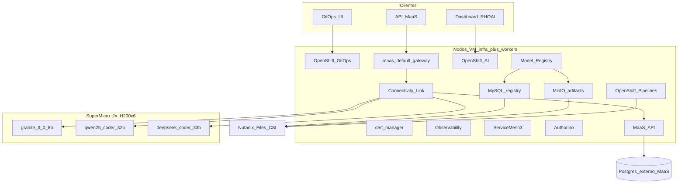

# Instalación Helm — ocpai-prd-mtz

Pasos exactos para instalar todos los charts del overlay en el cluster **ocpai-prd-mtz** (11 nodos). Helm **3.14+** y `cluster-admin`.

## Topología

| Rol | Cantidad | Tipo | vCPU / RAM (neto grupo) | Cargas |
| --- | --- | --- | --- | --- |
| Masters | 3 | VM | 30 vCPU / 180 Gi | Control plane. **No schedulable** |
| Infra | 3 | VM | 42 vCPU / 180 Gi | Plataforma (RHOAI, GitOps, Pipelines, SM3, RHCL, Authorino, registry) |
| Workers virt | 3 | VM | 33 vCPU / 90 Gi | Misma plataforma que infra |
| Workers GPU | 2 | SuperMicro SYS-521GE-TNRT | 248 vCPU / 2968 Gi + 12× H200 | **Solo** inferencia LLM |

Los nodos plataforma llevan el label `workload.rhoai.io/platform=true`. Los SuperMicro llevan taint `nvidia.com/gpu=true:NoSchedule`.

```mermaid
flowchart LR
  subgraph wave0 [Wave0_Day0]
    login[oc_login]
    labels[Labels_y_taints]
    secrets[Secrets_Postgres_HF]
  end
  subgraph wave1 [Wave1]
    cert[cert_manager]
    o11y[observability_operators]
    addons1[platform_addons]
  end
  subgraph wave2 [Wave2]
    gpuOp[nvidia_gpu_enablement]
    lws[leaderworkerset]
    cl[rhcl]
  end
  subgraph wave3 [Wave3]
    sm[service_mesh_operators]
    gtw[gateway_api]
  end
  subgraph wave4 [Wave4]
    pgw[maas_postgres_wiring]
  end
  subgraph wave5 [Wave5]
    oai[openshift_ai]
    mr[ModelRegistry_CR]
  end
  subgraph wave87 [Wave8_y_7]
    llms[llmisvc_x3]
    subs[maas_subscriptions]
  end
  wave0 --> wave1 --> wave2 --> wave3 --> wave4 --> wave5 --> wave87
```





## 0. Variables y Day-0

```bash
cd /path/to/rhoai-helm
export CLUSTER=clusters/ocpai-prd-mtz
export CHARTS=charts

# Editar antes de continuar:
#   $CLUSTER/cluster.yaml          → global.cluster.baseDomain
#   $CLUSTER/platform/values/platform-addons/values.yaml
#       storage.files.parameters.nfsServerName  (File Server en Prism, sin FQDN)
#       modelRegistry.mysql.password / rootPassword
#       modelRegistry.minio.rootPassword

oc login --server=<api.ocpai-prd-mtz> -u <kubeadmin>

export GPU_NODES="supermicro-1 supermicro-2"
export PLATFORM_NODES="infra-1 infra-2 infra-3 worker-1 worker-2 worker-3"

export MAAS_DB_CONNECTION_URL='postgresql://maas:<password>@<host>:5432/maas?sslmode=require'
export HF_TOKEN='hf_...'

./clusters/ocpai-prd-mtz/scripts/day0.sh
```

`day0.sh` etiqueta plataforma, taint GPU, crea `maas-db-config` y `hf-token`. Nutanix CSI debe existir (`ntnx-secret` en `openshift-cluster-csi-drivers`).

## 1. Dependencias Helm

```bash
for c in cert-manager nvidia-gpu-enablement rhcl leaderworkerset openshift-ai \
         observability-operators service-mesh-operators platform-addons; do
  (cd charts/$c && helm dependency update)
done
```

`installPlanApproval: Manual`: después de cada Subscription ejecutar:

```bash
./clusters/ocpai-prd-mtz/scripts/approve-installplans.sh
```

## 2. Wave 1 — cert-manager, observabilidad, storage, GitOps, Pipelines

```bash
helm upgrade --install cert-manager charts/cert-manager \
  -n cert-manager-operator --create-namespace \
  -f $CLUSTER/cluster.yaml \
  -f $CLUSTER/platform/values/cert-manager/values.yaml

helm upgrade --install observability-operators charts/observability-operators \
  -n openshift-operators \
  -f $CLUSTER/cluster.yaml \
  -f $CLUSTER/platform/values/observability-operators/values.yaml

helm upgrade --install platform-addons charts/platform-addons \
  -n rhoai-model-registries --create-namespace \
  -f $CLUSTER/cluster.yaml \
  -f $CLUSTER/platform/values/platform-addons/values.yaml \
  --set modelRegistry.createCR=false

./clusters/ocpai-prd-mtz/scripts/approve-installplans.sh \
  cert-manager-operator openshift-operators \
  openshift-gitops-operator
```

Esperar CSV `Succeeded` de cert-manager, GitOps y Pipelines.

## 3. Wave 2 — GPU, LeaderWorkerSet, Connectivity Link

```bash
helm upgrade --install nvidia-gpu-enablement charts/nvidia-gpu-enablement \
  -n openshift-nfd --create-namespace \
  -f $CLUSTER/cluster.yaml \
  -f $CLUSTER/platform/values/nvidia-gpu-enablement/values.yaml

helm upgrade --install leaderworkerset charts/leaderworkerset \
  -n openshift-lws-operator --create-namespace \
  -f $CLUSTER/cluster.yaml \
  -f $CLUSTER/platform/values/leaderworkerset/values.yaml

helm upgrade --install rhcl charts/rhcl \
  -n kuadrant-system --create-namespace \
  -f $CLUSTER/cluster.yaml \
  -f $CLUSTER/platform/values/rhcl/values.yaml

./clusters/ocpai-prd-mtz/scripts/approve-installplans.sh \
  openshift-nfd nvidia-gpu-operator openshift-lws-operator kuadrant-system
```

Validar `nvidia.com/gpu: 6` en cada SuperMicro. Authorino y Kuadrant quedan en VMs (sin toleration GPU).

## 4. Wave 3 — Service Mesh 3 y Gateway MaaS

```bash
helm upgrade --install service-mesh-operators charts/service-mesh-operators \
  -n openshift-operators \
  -f $CLUSTER/cluster.yaml \
  -f $CLUSTER/platform/values/service-mesh-operators/values.yaml

./clusters/ocpai-prd-mtz/scripts/approve-installplans.sh openshift-operators
# Esperar CSV servicemeshoperator3.v3.3.3 Succeeded

helm upgrade --install gateway-api charts/gateway-api \
  -n openshift-ingress \
  -f $CLUSTER/cluster.yaml \
  -f $CLUSTER/platform/values/gateway-api/values.yaml
```

Ruta: `https://maas.apps.ocpai-prd-mtz.<baseDomain>`.

## 5. Wave 4 — wiring Postgres MaaS (sin Postgres in-cluster)

```bash
helm upgrade --install maas-postgres charts/maas-postgres \
  -n redhat-ods-applications --create-namespace \
  -f $CLUSTER/cluster.yaml \
  -f $CLUSTER/platform/values/maas-postgres/values.yaml
```

## 6. Wave 5 — OpenShift AI, MaaS y Model Registry CR

```bash
helm upgrade --install openshift-ai charts/openshift-ai \
  -n redhat-ods-operator --create-namespace \
  -f $CLUSTER/cluster.yaml \
  -f $CLUSTER/platform/values/openshift-ai/values.yaml

./clusters/ocpai-prd-mtz/scripts/approve-installplans.sh redhat-ods-operator

helm upgrade --install platform-addons charts/platform-addons \
  -n rhoai-model-registries \
  -f $CLUSTER/cluster.yaml \
  -f $CLUSTER/platform/values/platform-addons/values.yaml \
  --set modelRegistry.createCR=true
```

DSC: `modelregistry.managementState: Managed`, namespace `rhoai-model-registries`. Referencia: [Making the RHOAI Model Registry Work for You](https://redhatquickcourses.github.io/rhoai3-registry/rhoai3-registry/1/index.html).

## 7. Wave 8 luego 7 — modelos y suscripciones MaaS

No instalar simulators. Tres releases `llmisvc` (solo nodos GPU):

```bash
helm upgrade --install llmisvc-granite-3-0-8b charts/llmisvc \
  -n ai-models --create-namespace \
  -f $CLUSTER/cluster.yaml \
  -f $CLUSTER/values/llmisvc/granite-3.0-8b-instruct.yaml

helm upgrade --install llmisvc-qwen25-coder-32b charts/llmisvc \
  -n ai-models --set namespace.create=false \
  -f $CLUSTER/cluster.yaml \
  -f $CLUSTER/values/llmisvc/qwen2.5-coder-32b.yaml

helm upgrade --install llmisvc-deepseek-coder-33b charts/llmisvc \
  -n ai-models --set namespace.create=false \
  -f $CLUSTER/cluster.yaml \
  -f $CLUSTER/values/llmisvc/deepseek-coder-33b.yaml

helm upgrade --install maas-subscriptions charts/maas-subscriptions \
  -n models-as-a-service --create-namespace \
  -f $CLUSTER/cluster.yaml \
  -f $CLUSTER/values/maas-subscriptions/values.yaml
```

Atajo: `./clusters/ocpai-prd-mtz/scripts/install-waves.sh` y `./scripts/install-models.sh`.

## 8. Validación

```bash
./clusters/ocpai-prd-mtz/scripts/validate.sh
export MAAS_API_KEY=...
./clusters/ocpai-prd-mtz/scripts/validate.sh
```

## StorageClass y PVCs (Nutanix Files)

| Recurso | Namespace | Tamaño | AccessMode | Uso |
| --- | --- | --- | --- | --- |
| StorageClass `nutanix-files-dynamic` | cluster | — | RWX/RWO | CSI `csi.nutanix.com` / `NutanixFiles` |
| `model-registry-mysql-data` | `rhoai-model-registries` | 20Gi | RWO | MySQL metadata del registry |
| `model-registry-minio-data` | `rhoai-model-registries` | 200Gi | RWX | Object storage S3 de artefactos |
| `rhods-notebooks-shared` | `rhods-notebooks` | 50Gi | RWX | Workbenches |
| `pipelines-artifacts` | `openshift-pipelines` | 100Gi | RWX | Artefactos Tekton |

`nfsServerName` es el nombre del File Server en Prism, no el FQDN. Secret CSI: `ntnx-secret` en `openshift-cluster-csi-drivers`.

## Namespaces y charts

| Chart | Namespace Helm | Qué instala |
| --- | --- | --- |
| cert-manager | cert-manager-operator | Operator cert-manager |
| observability-operators | openshift-operators | Tempo, COO, OpenTelemetry |
| platform-addons | rhoai-model-registries | SC/PVC, GitOps, Pipelines, MySQL, MinIO, ModelRegistry |
| nvidia-gpu-enablement | openshift-nfd | NFD + GPU Operator |
| leaderworkerset | openshift-lws-operator | LWS |
| rhcl | kuadrant-system | Connectivity Link / Kuadrant / Authorino |
| service-mesh-operators | openshift-operators | SM3 operator (CSV pin 3.3.3) |
| gateway-api | openshift-ingress | `maas-default-gateway` + Route |
| maas-postgres | redhat-ods-applications | Solo secret externo |
| openshift-ai | redhat-ods-operator | RHOAI 3.4, DSC MaaS + Model Registry operator |
| llmisvc ×3 | ai-models | Granite, Qwen2.5-Coder, DeepSeek-Coder |
| maas-subscriptions | models-as-a-service | ModelRef, Subscription, AuthPolicy |
