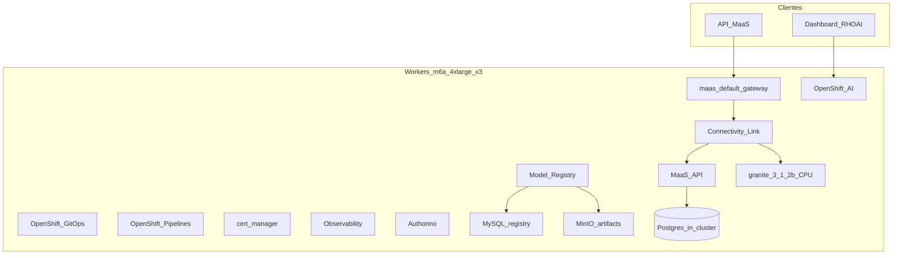

# Instalación Helm — OpenTLC lab (`cluster-6f7dh`)

Laboratorio para **ensayar, corregir y validar** la pila RHOAI + MaaS. Sin GPU. Helm **3.14+** y `cluster-admin`.

Consola: https://console-openshift-console.apps.cluster-6f7dh.6f7dh.sandbox3519.opentlc.com/

## Topología

| Rol | Cantidad | Instance type | vCPU / RAM por nodo | Cargas |
| --- | --- | --- | --- | --- |
| Control plane | 3 | m6a.2xlarge | 8 / 30.67 GiB | Control plane. **No schedulable** |
| Workers | 3 | m6a.4xlarge | 16 / 61.46 GiB | Plataforma + SLM CPU |

Región `us-east-2`. Disco por nodo ~99.78 GiB. Los workers llevan `workload.rhoai.io/platform=true`. No hay taint GPU.

```mermaid
flowchart LR
  subgraph wave0 [Wave0_Day0]
    login[oc_login]
    labels[Labels_workers]
  end
  subgraph wave1 [Wave1]
    cert[cert_manager]
    o11y[observability_operators]
    addons1[platform_addons]
  end
  subgraph wave2 [Wave2]
    lws[leaderworkerset]
    cl[rhcl]
  end
  subgraph wave3 [Wave3]
    gtw[gateway_api]
  end
  subgraph wave4 [Wave4]
    pgw[maas_postgres]
  end
  subgraph wave5 [Wave5]
    oai[openshift_ai]
    mr[ModelRegistry_CR]
  end
  subgraph wave87 [Wave8_y_7]
    llm[llmisvc_granite_2b_cpu]
    subs[maas_subscriptions]
  end
  wave0 --> wave1 --> wave2 --> wave3 --> wave4 --> wave5 --> wave87
```





## 0. Variables y Day-0

```bash
cd /path/to/rhoai-helm
export CLUSTER=clusters/opentlc
export CHARTS=charts

oc login --server=https://api.cluster-6f7dh.6f7dh.sandbox3519.opentlc.com:6443

./clusters/opentlc/scripts/day0.sh
```

## 1. Dependencias Helm

```bash
for c in cert-manager rhcl leaderworkerset openshift-ai \
         observability-operators platform-addons; do
  (cd charts/$c && helm dependency update)
done
```

No ejecutar `helm dependency update` ni `helm upgrade` de `nvidia-gpu-enablement`.

`installPlanApproval: Manual`:

```bash
./clusters/opentlc/scripts/approve-installplans.sh
```

## 2. Wave 1 — cert-manager, observabilidad, GitOps, Pipelines, PVCs

El namespace `cert-manager-operator` suele existir ya en OpenTLC. El chart no lo vuelve a crear; Helm usa `--create-namespace` solo si faltara. **No** uses `--take-ownership` sobre ese Namespace: el uninstall borraría el NS de plataforma.

```bash
helm upgrade --install cert-manager charts/cert-manager \
  -n cert-manager-operator --create-namespace \
  -f $CLUSTER/cluster.yaml \
  -f $CLUSTER/platform/values/cert-manager/values.yaml

El overlay OpenTLC usa `installPlanApproval: Automatic` sin `startingCSV`. El pin `cert-manager-operator.v1.19.0` del chart no suele existir en el catálogo del sandbox; el Job `approve-openshift-cert-manager-operator` espera un InstallPlan que nunca aparece.

Si un intento anterior dejó el release en `failed`:

```bash
oc delete job approve-openshift-cert-manager-operator -n cert-manager-operator --ignore-not-found
oc get sub,ip,csv -n cert-manager-operator
oc get packagemanifest openshift-cert-manager-operator -o jsonpath='{range .status.channels[*]}{.name}{"\t"}{.currentCSV}{"\n"}{end}'
```

helm upgrade --install observability-operators charts/observability-operators \
  -n openshift-operators --timeout 20m \
  -f $CLUSTER/cluster.yaml \
  -f $CLUSTER/platform/values/observability-operators/values.yaml

helm upgrade --install platform-addons charts/platform-addons \
  -n rhoai-model-registries --create-namespace \
  -f $CLUSTER/cluster.yaml \
  -f $CLUSTER/platform/values/platform-addons/values.yaml \
  --set modelRegistry.createCR=false
```

OpenTLC/RHDP suele pre-crear `openshift-gitops-operator` (y a veces `openshift-gitops` / `openshift-pipelines`). El chart **no** adopta esos Namespaces (`lookup`); **no** uses `--take-ownership` o un uninstall borraría namespaces de plataforma.

El Job `patch-perses-operator-resources` **no debe bloquear** este Helm (COO-784 está corregido desde COO 1.1.1). Si un intento anterior dejó el release en `failed` y el Job en `InProgress`, borrar el Job y reintentar:

```bash
oc delete job patch-perses-operator-resources -n openshift-cluster-observability-operator --ignore-not-found
helm history observability-operators -n openshift-operators
```

Cómo inspeccionar el hook a mano:

```bash
oc get job,pods -n openshift-cluster-observability-operator -l job-name=patch-perses-operator-resources
oc logs -n openshift-cluster-observability-operator -l job-name=patch-perses-operator-resources --tail=80
oc get sub,csv,ip,deploy,pods -n openshift-cluster-observability-operator
oc get sub,csv,ip -n openshift-tempo-operator
oc get sub,csv,ip -n openshift-opentelemetry-operator
```

Los CSV de Tempo/COO/OTel viven en esos namespaces, no en `openshift-operators`.

StorageClass del lab: `gp3-csi` (RWO). No se crea Nutanix Files.

## 3. Wave 2 — LeaderWorkerSet y Connectivity Link (sin NVIDIA)

```bash
helm upgrade --install leaderworkerset charts/leaderworkerset \
  -n openshift-lws-operator --create-namespace \
  -f $CLUSTER/cluster.yaml \
  -f $CLUSTER/platform/values/leaderworkerset/values.yaml

helm upgrade --install rhcl charts/rhcl \
  -n kuadrant-system --create-namespace \
  -f $CLUSTER/cluster.yaml \
  -f $CLUSTER/platform/values/rhcl/values.yaml

./clusters/opentlc/scripts/approve-installplans.sh \
  openshift-lws-operator kuadrant-system
```

## 4. Wave 3 — Gateway API (Ingress Operator)

Igual que producción: **no** instalar `charts/service-mesh-operators` (referencia legada). Ver [charts/service-mesh-operators/README.md](../../charts/service-mesh-operators/README.md).

```bash
helm upgrade --install gateway-api charts/gateway-api \
  -n openshift-ingress \
  -f $CLUSTER/cluster.yaml \
  -f $CLUSTER/platform/values/gateway-api/values.yaml

oc get gatewayclass openshift-default -o yaml
```

Ruta: `https://maas.apps.cluster-6f7dh.6f7dh.sandbox3519.opentlc.com`.

## 5. Wave 4 — Postgres MaaS in-cluster

```bash
helm upgrade --install maas-postgres charts/maas-postgres \
  -n redhat-ods-applications --create-namespace \
  -f $CLUSTER/cluster.yaml \
  -f $CLUSTER/platform/values/maas-postgres/values.yaml
```

Esperar Job `create-maas-db-config`. Credenciales de lab: `maas` / `opentlc-lab`.

## 6. Wave 5 — OpenShift AI, MaaS y Model Registry CR

```bash
helm upgrade --install openshift-ai charts/openshift-ai \
  -n redhat-ods-operator --create-namespace \
  -f $CLUSTER/cluster.yaml \
  -f $CLUSTER/platform/values/openshift-ai/values.yaml

./clusters/opentlc/scripts/approve-installplans.sh redhat-ods-operator

helm upgrade --install platform-addons charts/platform-addons \
  -n rhoai-model-registries \
  -f $CLUSTER/cluster.yaml \
  -f $CLUSTER/platform/values/platform-addons/values.yaml \
  --set modelRegistry.createCR=true
```

## 7. Wave 8 luego 7 — SLM CPU y suscripciones MaaS

No instalar los tres modelos GPU de `ocpai-prd-mtz`. Un solo `LLMInferenceService` en CPU:

```bash
helm upgrade --install llmisvc-granite-3-1-2b charts/llmisvc \
  -n ai-models --create-namespace \
  -f $CLUSTER/cluster.yaml \
  -f $CLUSTER/values/llmisvc/granite-3.1-2b-instruct.yaml

helm upgrade --install maas-subscriptions charts/maas-subscriptions \
  -n models-as-a-service --create-namespace \
  -f $CLUSTER/cluster.yaml \
  -f $CLUSTER/values/maas-subscriptions/values.yaml
```

Modelo: `ibm-granite/granite-3.1-2b-instruct` (2B, imagen `registry.redhat.io/rhaii/vllm-cpu-rhel9:3.4.1`). Sirve para probar Gateway, MaaSModelRef, MaaSSubscription, MaaSAuthPolicy y `/v1/chat/completions`.

Atajo: `./clusters/opentlc/scripts/install-waves.sh` y `./scripts/install-models.sh`.

## 8. Validación

```bash
./clusters/opentlc/scripts/validate.sh
export MAAS_API_KEY=...
./clusters/opentlc/scripts/validate.sh
```

## StorageClass y PVCs (gp3-csi)

| Recurso | Namespace | Tamaño | AccessMode |
| --- | --- | --- | --- |
| `model-registry-mysql-data` | `rhoai-model-registries` | 10Gi | RWO |
| `model-registry-minio-data` | `rhoai-model-registries` | 20Gi | RWO |
| `rhods-notebooks-shared` | `rhods-notebooks` | 10Gi | RWO |
| `pipelines-artifacts` | `openshift-pipelines` | 20Gi | RWO |

EBS `gp3-csi` no ofrece RWX; los tamaños son de laboratorio.

## Namespaces y charts

| Chart | Namespace Helm | Qué instala |
| --- | --- | --- |
| cert-manager | cert-manager-operator | Operator cert-manager |
| observability-operators | openshift-operators | Tempo, COO, OpenTelemetry |
| platform-addons | rhoai-model-registries | PVCs gp3, GitOps, Pipelines, MySQL, MinIO, ModelRegistry |
| leaderworkerset | openshift-lws-operator | LWS |
| rhcl | kuadrant-system | Connectivity Link / Kuadrant / Authorino |
| gateway-api | openshift-ingress | `maas-default-gateway` + Route |
| maas-postgres | redhat-ods-applications | Postgres in-cluster + `maas-db-config` |
| openshift-ai | redhat-ods-operator | RHOAI 3.4, DSC MaaS + Model Registry |
| llmisvc | ai-models | Granite 3.1 2B CPU |
| maas-subscriptions | models-as-a-service | ModelRef, Subscription, AuthPolicy (free) |

No se instalan `nvidia-gpu-enablement` ni `service-mesh-operators`.
